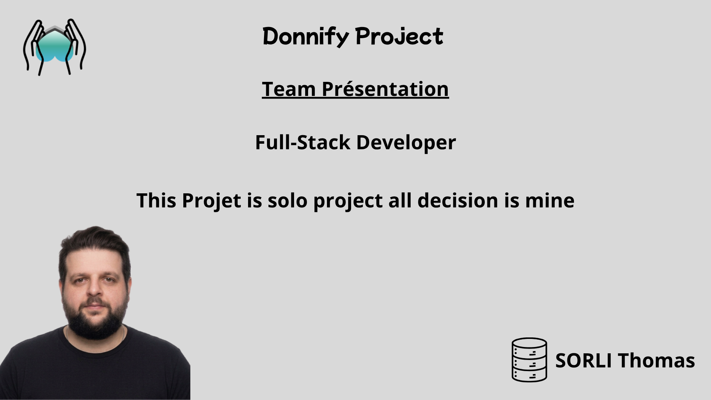

# DONNIFY PROJECT

***
# Table of Contents
1. [Brainstorming and MVP](#Brainstorming-and-MVP)
    1. [Project Overview](#Project-Overview)
    2. [Evaluation Criteria](#Evaluation-Criteria)
    3. [Overall Conclusion](#Overall-Conclusion)
    4. [Reflection and Ideation Process](#Reflection-and-Ideation-Process)
    5. [Final Idea](#Final-Idea)
    6. [MVP Definition](#MVP-Definition)
    7. [SMART Objectives](#SMART-Objectives)
    8. [Project Scope](#Project-Scope)
    9. [Risks and Solutions](#Risks-and-Solutions)
    10. [Final Conclusion](#Final-Conclusion)
***
# Brainstorming and MVP
## Project Overview
This project is a gamified application designed to encourage donations to charitable organizations. It aims to increase user engagement through game mechanics and motivate people to contribute more easily and frequently.
## Evaluation Criteria
| Criterion | Analysis | Conclusion |
|----------|----------|----------|
| Impact  | Positive – Responds to a real need by encouraging more donations.  | High social value  |
| Feasibility  | Medium – Possible with current skills, but the application will not be fully completed or optimized.  | Partially achievable  |
|Technical Alignment | Medium – Some technologies are mastered, others require learning. | Requires adaptation |
| Scalability | High – Strong potential for future feature expansion. | Very promising |
| Risk | High – Due to time constraints and technical complexity. | Requires strict scope control |
## Overall Conclusion
The project is feasible despite technical complexity and limited time. A functional MVP can be achieved if priorities are well defined.
## Reflection and Ideation Process
Although I started with a strong personal idea, I followed a structured research process to ensure its relevance and realism.
### I analyzed:
- Real-world problems
- Existing solutions
- Current market and technology trends

This helped me better understand the context of the project.

To structure my thinking, I used the “How Might We” technique, which helped reformulate the problem into opportunities such as:
- Improving donation accessibility
- Increasing motivation to donate

This reflection confirmed the value, feasibility, and relevance of the project.
## Final Idea
A gamified application that encourages charitable donations through engagement and progression systems.
## MVP Definition
### Problem
Charitable organizations lack visibility, and users often lack motivation to donate.
### Solution
A gamified system that encourages donations through rewards and engagement mechanics.
### Target Users
- Young adults
- Users interested in gamification
- Socially engaged individuals
### Platform
Web and mobile application
### Reason for Choosing This Idea
- Strong personal motivation
- Social impact
- Feasible implementation
## SMART Objectives
### User Registration System
- Simple account creation for users and organizations.
### Interactive Map
- Display nearby organizations and donation locations via geolocation.
### Leveling System (Core Feature)
- Users gain experience points through actions; this is the main mechanic of the application.
## Project Scope
### In Scope (MVP)
- Simple interface
- Point system
- Home page
- User profile
- Basic missions and challenges
### Out of Scope
- Real financial donations
- Reward marketplace
- Global leaderboards
- Push notifications
## Risks and Solutions
### Risks
- Lack of time
- Technical complexity
- Learning new technologies
### Solutions
- Focus on MVP only
- Break tasks into smaller steps
- Prioritize core features
## Final Conclusion
This project combines social impact and gamification in a meaningful way. While ambitious, it remains achievable if the scope is controlled and the MVP is prioritized.

