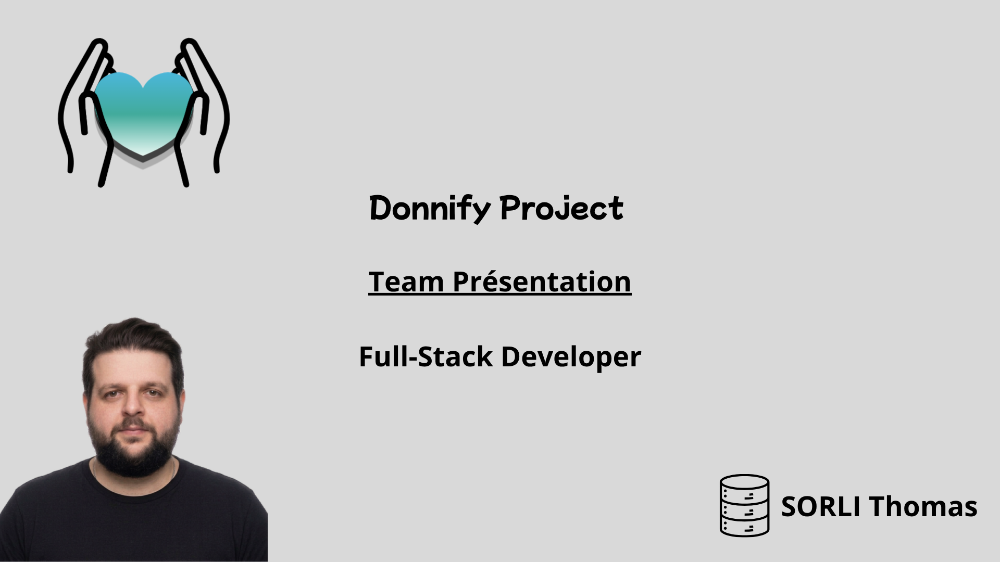
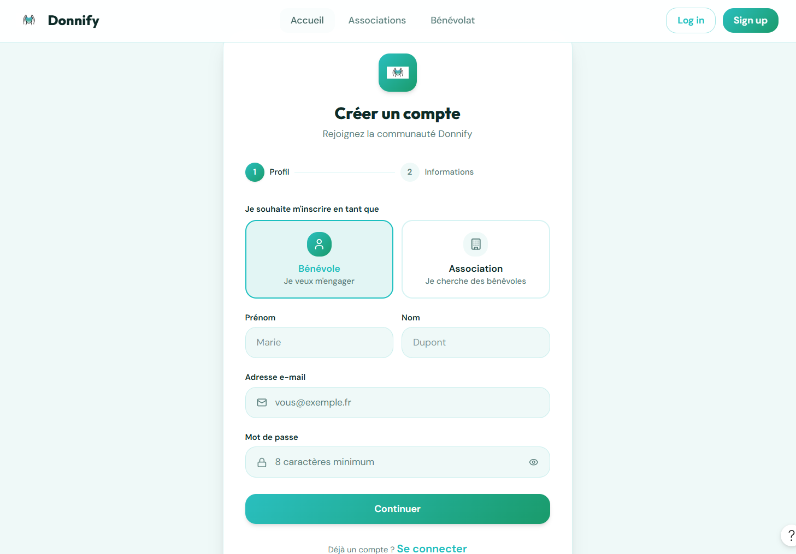
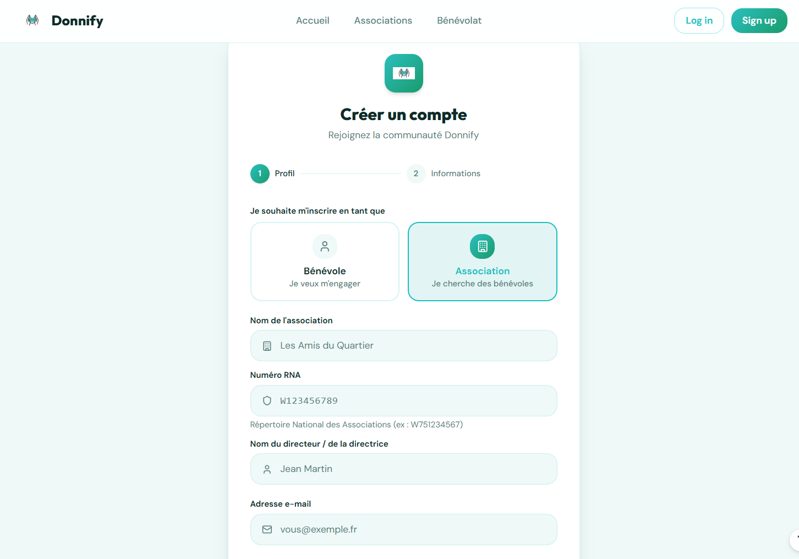
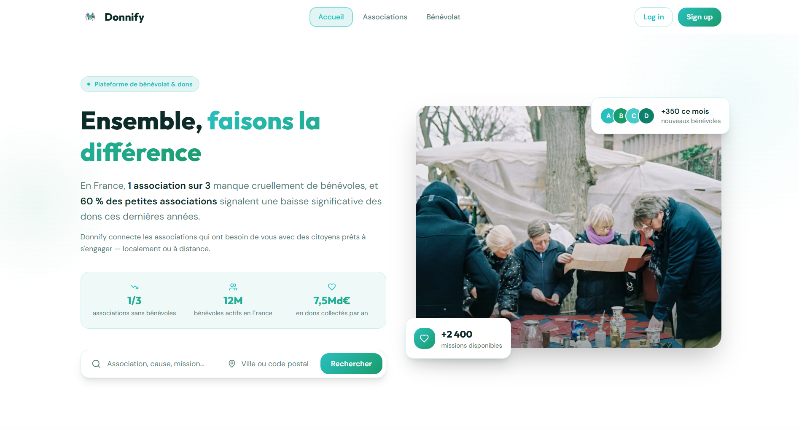
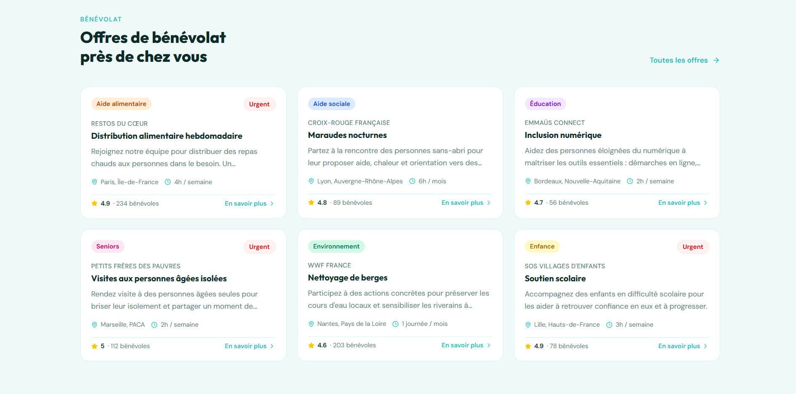
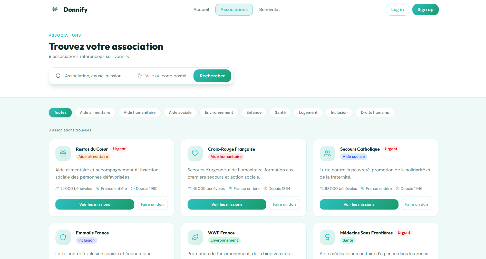
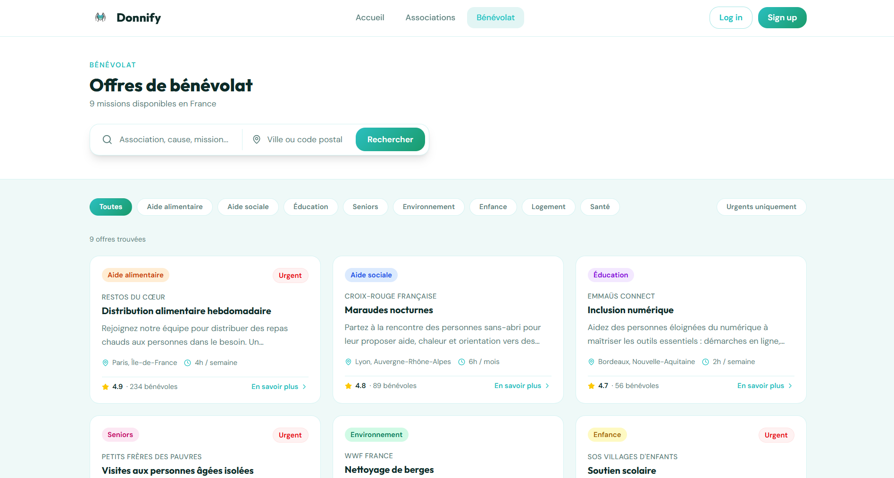
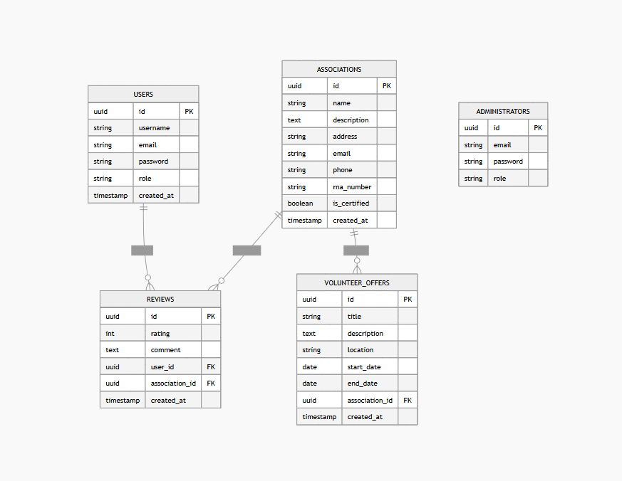
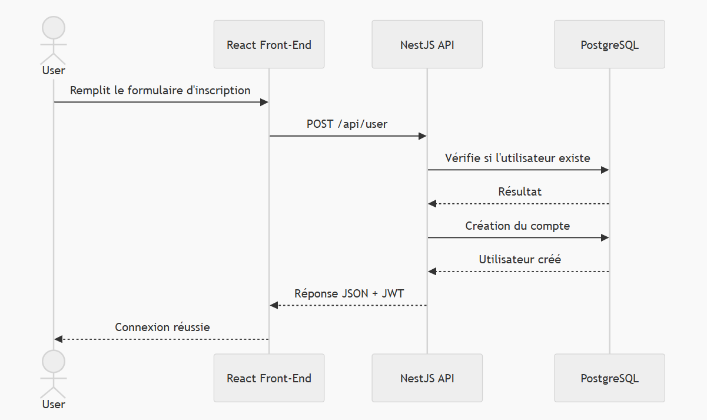

---

# Table of Contents

1. [Brainstorming and MVP](#1-brainstorming-and-mvp)
   - [Project Overview](#project-overview)
   - [Evaluation Criteria](#evaluation-criteria)
   - [Overall Conclusion](#overall-conclusion)
   - [Reflection and Ideation Process](#reflection-and-ideation-process)
   - [Final Idea](#final-idea)
   - [MVP Definition](#mvp-definition)
   - [SMART Objectives](#smart-objectives)
   - [Project Scope](#project-scope)
   - [Risks and Solutions](#risks-and-solutions)
   - [Future Objectives](#future-objectives)
   - [Final Conclusion](#final-conclusion)

2. [Project Planning](#2-project-planning)
   - [General and Specific Objectives](#general-and-specific-objectives)
   - [Project Scope](#project-scope-1)
   - [Key Elements of the Project](#key-elements-of-the-project)
   - [SMART Objectives](#smart-objectives-1)
   - [SMART Objectives Detailed by MVP](#smart-objectives-detailed-by-mvp)
   - [High-Level Project Timeline](#high-level-project-timeline)
   - [Conclusion](#conclusion)

3. [Technical Documentation](#3-technical-documentation)
   - [User Stories and Mockups](#user-stories-and-mockups)
   - [System Architecture](#system-architecture)
   - [Components, Classes, and Database Design](#components-classes-and-database-design)
   - [High-Level Sequence Diagrams](#high-level-sequence-diagrams)
   - [External and Internal APIs Documentation](#external-and-internal-apis-documentation)
   - [Plan SCM and QA Strategies](#plan-scm-and-qa-strategies)

---

# 1. Brainstorming and MVP

## Project Overview

Donnify is a gamified platform designed to improve the visibility of charitable associations and encourage community engagement through donations and volunteer participation.

The platform allows users to easily discover nearby associations, understand their needs, and contribute through material donations or volunteer activities.

The MVP focuses on accessibility, association visibility, and volunteer management.

---

## Evaluation Criteria

| Criterion | Analysis | Conclusion |
|---|---|---|
| Impact | Responds to a real social need by improving association visibility and encouraging participation. | High Social Value |
| Feasibility | Achievable with current technical skills and realistic MVP limitations. | Feasible MVP |
| Technical Alignment | Most technologies are already mastered, while some require additional learning. | Requires Adaptation |
| Scalability | Strong potential for future feature expansion and mobile deployment. | Very Promising |
| Risk | Time constraints and technical complexity may impact development speed. | Requires Scope Control |

---

## Overall Conclusion

The project is achievable within the defined timeframe if the MVP remains focused on core functionalities and scope limitations are respected.

---

## Reflection and Ideation Process

The project idea was validated through research and analysis of:

- Real-world problems
- Existing solutions
- Current technology trends
- User engagement strategies

The “How Might We” method was used to reformulate the initial problem into actionable opportunities:

- How might we improve association visibility?
- How might we simplify volunteer participation?
- How might we encourage donations through modern digital tools?

This process confirmed the relevance and feasibility of the project.

---

## Final Idea

Donnify is a platform that centralizes charitable associations and simplifies volunteer engagement through a modern and accessible interface.

---

## MVP Definition

### Problem

Many charitable associations lack visibility, while users often struggle to identify nearby organizations and understand how to contribute effectively.

### Solution

A web and mobile platform that centralizes associations, volunteer offers, and donation information.

### Target Users

- Young adults
- Socially engaged individuals
- Volunteers
- Local associations

### Platform

- Web Application
- Mobile Application

### Reason for Choosing This Idea

- Strong social impact
- Personal motivation
- Realistic MVP implementation
- Expandable future potential

---

## SMART Objectives

### User Registration System

Create a secure registration system for users and associations.

### Volunteer Offers Dashboard

Display volunteer offers, association information, and mission details.

### Association Certification System

Allow users to identify verified associations through a certified badge.

### Interactive Map

Allow users to locate nearby associations and access directions.

---

## Project Scope

### In Scope

- User authentication
- Association registration
- Volunteer offers dashboard
- Interactive map
- User profile
- Association certification system
- Reviews and ratings
- Responsive interface

### Out of Scope

- Online payment system
- Financial donation processing
- Advanced gamification systems
- Experience points system
- Quests and achievements
- Reward marketplace
- Push notifications
- Social messaging system

---

## Risks and Solutions

### Risks

- Limited development time
- Technical complexity
- Learning new technologies

### Solutions

- Focus only on MVP features
- Divide development into smaller tasks
- Prioritize core functionalities
- Maintain a strict project scope

---

## Future Objectives

Future versions of Donnify may include advanced gamification systems to increase user engagement.

Possible future features include:

- Experience points system
- User levels
- Achievement badges
- Cosmetic profile rewards
- Donor leaderboard
- Seasonal events
- Volunteer progression system

---

## Final Conclusion

Donnify combines social engagement and modern accessibility to help associations gain visibility and encourage community participation.

The MVP focuses on essential features while leaving room for future expansion and gamification systems.

---

# 2. Project Planning

## General and Specific Objectives

The objective of Donnify is to centralize charitable associations and improve their visibility through a modern web and mobile platform.

The platform helps users quickly:

- Discover nearby associations
- Understand association needs
- Access volunteer opportunities
- Participate in community engagement

---

## Project Scope

To guarantee feasibility and consistency, the project follows a strict MVP approach.

### In Scope

The platform includes:

- Association directory
- Volunteer offers system
- Interactive map
- User authentication
- User profiles
- Association certification
- Reviews and ratings

### Out of Scope

The project does not include:

- Online payment processing
- Advanced social systems
- Advertising or monetization
- Advanced profile customization
- Large-scale international deployment
- Advanced gamification mechanics

---

## Key Elements of the Project

The project is built around three main objectives:

1. Improve association visibility
2. Simplify volunteer participation
3. Provide a modern and accessible platform

The MVP focuses on usability, accessibility, and simplicity.

---

## SMART Objectives

### Specific

Develop a platform that centralizes local associations and volunteer opportunities.

### Measurable

Include:

- At least 50 associations
- A functional interactive map
- User authentication
- Volunteer offer management

### Achievable

Use accessible and realistic technologies without advanced monetization or gamification systems.

### Relevant

Encourage civic engagement and improve association visibility.

### Time-Bound

Deliver a functional MVP within 12 weeks.

---

## SMART Objectives Detailed by MVP

### Association Directory

Create a database containing:

- Association name
- Accepted donations
- Address
- Contact information

Target: at least 50 associations before MVP release.

### Interactive Map

Allow users to:

- View nearby associations
- Access directions
- Explore volunteer opportunities

### User Profile System

Allow users to:

- Create accounts
- Manage profiles
- Track participation history

### Volunteer Offers System

Allow associations to:

- Publish volunteer offers
- Define mission requirements
- Validate volunteer participation

### Responsive Interface

Provide a clear and accessible web and mobile interface.

---

## High-Level Project Timeline

| Stage | Period | Project Phase | Description |
|---|---|---|---|
| Stage 1 | April 20 - May 1, 2026 | Team Formation and MVP Definition | Define project scope, objectives, and MVP structure. |
| Stage 2 | May 4 - May 22, 2026 | Technical Documentation | Prepare technical and functional documentation. |
| Stage 3 | May 25 - July 3, 2026 | MVP Development | Develop and test core functionalities. |
| Stage 4 | July 6 - July 17, 2026 | Final Delivery | Final testing, portfolio preparation, and presentation. |

---

## Conclusion

Donnify aims to provide a simple and accessible platform that improves association visibility and simplifies volunteer participation.

The project follows a structured MVP approach with clearly defined objectives, realistic scope limitations, and scalable future possibilities.

---

# 3. Technical Documentation

## User Stories and Mockups

### Types of Users

### Users

Users can:

- Search for associations
- Explore volunteer offers
- Track participation history
- Manage their profiles

### Associations

Associations can:

- Create volunteer offers
- Validate volunteer participation
- Manage association information

### Administrators

Administrators can:

- Certify associations
- Moderate users and associations
- Manage platform security

---

## User Stories

| ID | User Story | Priority |
|---|---|---|
| US1 | As a user, I want to create an account so that I can access the platform. | Must Have |
| US2 | As a user, I want to manage my profile so that I can track my participation history. | Must Have |
| US3 | As a user, I want to identify certified associations so that I can trust the platform. | Must Have |
| US4 | As a user, I want to explore volunteer offers so that I can participate in local activities. | Must Have |
| US5 | As a user, I want to view reviews on my profile so that I can track my reputation. | Must Have |
| US6 | As an association, I want to create an account so that I can publish volunteer offers. | Must Have |
| US7 | As an association, I want to validate volunteer participation so that I can confirm mission completion. | Must Have |
| US8 | As an administrator, I want to certify associations so that I can ensure platform reliability. | Must Have |
| US9 | As an administrator, I want to moderate users and associations so that I can prevent misconduct. | Must Have |

---

## Mockups

### Login / Sign-Up Page

- Email field
- Password field
- Association registration form
- Login and registration buttons





---

### Home Page



---

### Association Directory



---

### Volunteer Offers Page





---

## System Architecture


---

## Explanation of Data Flow

### 1. User Interaction

Users interact with the React application through:

- Volunteer offers
- Association pages
- User profiles
- Authentication pages

### 2. Frontend to Backend Communication

The React frontend communicates with the NestJS REST API using HTTP requests and JSON responses.

JWT authentication is used for session management and role authorization.

### 3. Backend Processing

The NestJS backend handles:

- Authentication
- Volunteer offer management
- Association certification
- Reviews and moderation

### 4. Database Communication

PostgreSQL stores:

- Users
- Associations
- Volunteer offers
- Reviews
- Certifications

### 5. External Services

#### RNA API

Used to verify association legitimacy.

#### Email Service

Used for:

- Registration confirmation
- Volunteer participation confirmation
- Platform notifications

# Components, Classes, and Database Design

## Overview

The Donnify platform is divided into three main parts:

- Frontend Components
- Backend Architecture
- PostgreSQL Relational Database

The system follows a modular architecture based on separation of concerns between presentation, business logic, and data management.

---

# Backend Components and Classes

The backend is built using NestJS and follows a modular REST API architecture.

## Main Backend Modules

### Authentication Module

Handles user authentication and authorization.

#### Main Classes

### AuthController

#### Responsibilities

- User registration
- User login
- JWT token generation

#### Main Methods

- register()
- login()
- validateUser()

---

### AuthService

#### Responsibilities

- Password hashing
- Token generation
- Authentication validation

#### Main Methods

- hashPassword()
- comparePasswords()
- generateJwtToken()

---

## User Module

Handles user profile management.

### User Entity

#### Attributes

| Attribute | Type | Description |
|---|---|---|
| id | UUID | Unique user identifier |
| username | String | User display name |
| email | String | User email |
| password | String | Encrypted password |
| role | Enum | User role |
| createdAt | Date | Account creation date |

#### Main Methods

- updateProfile()
- getUserProfile()
- getUserReviews()

---

## Association Module

Handles charitable association management.

### Association Entity

#### Attributes

| Attribute | Type | Description |
|---|---|---|
| id | UUID | Unique association identifier |
| name | String | Association name |
| description | String | Association presentation |
| address | String | Association location |
| email | String | Contact email |
| phone | String | Contact phone number |
| rnaNumber | String | Official RNA number |
| isCertified | Boolean | Certification status |
| createdAt | Date | Creation date |

#### Main Methods

- createAssociation()
- updateAssociation()
- certifyAssociation()

---

## Volunteer Offer Module

Handles volunteer opportunity management.

### VolunteerOffer Entity

#### Attributes

| Attribute | Type | Description |
|---|---|---|
| id | UUID | Unique offer identifier |
| title | String | Offer title |
| description | Text | Offer description |
| location | String | Volunteer location |
| startDate | Date | Mission start date |
| endDate | Date | Mission end date |
| associationId | UUID | Related association |
| createdAt | Date | Creation date |

#### Main Methods

- createOffer()
- updateOffer()
- deleteOffer()
- getOffers()

---

## Review Module

Handles user feedback and volunteer evaluations.

### Review Entity

#### Attributes

| Attribute | Type | Description |
|---|---|---|
| id | UUID | Unique review identifier |
| rating | Integer | User rating |
| comment | Text | Review comment |
| userId | UUID | Related user |
| associationId | UUID | Related association |
| createdAt | Date | Review date |

#### Main Methods

- createReview()
- deleteReview()
- getAssociationReviews()

---

## Administrator Module

Handles moderation and certification systems.

### Admin Entity

#### Attributes

| Attribute | Type | Description |
|---|---|---|
| id | UUID | Administrator identifier |
| email | String | Administrator email |
| password | String | Encrypted password |
| role | Enum | Administrator role |

#### Main Methods

- certifyAssociation()
- suspendUser()
- moderateContent()

---

## Frontend Components

The frontend is developed using React and organized into reusable UI components.

## Main UI Components

### Authentication Components

#### LoginForm Component

Handles:

- User login
- Form validation
- JWT storage

#### RegisterForm Component

Handles:

- User registration
- Association registration
- Error handling

---

## Association Components

### AssociationCard Component

Displays:

- Association name
- Address
- Certification badge
- Contact information

### AssociationList Component

Displays:

- List of nearby associations
- Search results
- Filtered associations

---

## Volunteer Components

### VolunteerOfferCard Component

Displays:

- Mission title
- Description
- Dates
- Location

### VolunteerOfferList Component

Displays:

- All volunteer offers
- Filtered offers
- Search results

---

## Profile Components

### UserProfile Component

Displays:

- User information
- Participation history
- Reviews

### ReviewList Component

Displays:

- User reviews
- Association feedback

---

## Navigation Components

### Navbar Component

Provides navigation between:

- Home page
- Associations
- Volunteer offers
- Profile
- Authentication pages

---

## Database Design

The project uses PostgreSQL as a relational database management system.

---

## Entity Relationship Overview

Main database entities:

- Users
- Associations
- VolunteerOffers
- Reviews
- Administrators

---

## Relational Database Schema

### users Table

| Column | Type | Constraints |
|---|---|---|
| id | UUID | Primary Key |
| username | VARCHAR | NOT NULL |
| email | VARCHAR | UNIQUE |
| password | VARCHAR | NOT NULL |
| role | VARCHAR | NOT NULL |
| created_at | TIMESTAMP | DEFAULT NOW() |

---

### associations Table

| Column | Type | Constraints |
|---|---|---|
| id | UUID | Primary Key |
| name | VARCHAR | NOT NULL |
| description | TEXT | NULL |
| address | VARCHAR | NOT NULL |
| email | VARCHAR | UNIQUE |
| phone | VARCHAR | NULL |
| rna_number | VARCHAR | UNIQUE |
| is_certified | BOOLEAN | DEFAULT FALSE |
| created_at | TIMESTAMP | DEFAULT NOW() |

---

### volunteer_offers Table

| Column | Type | Constraints |
|---|---|---|
| id | UUID | Primary Key |
| title | VARCHAR | NOT NULL |
| description | TEXT | NOT NULL |
| location | VARCHAR | NOT NULL |
| start_date | DATE | NOT NULL |
| end_date | DATE | NOT NULL |
| association_id | UUID | Foreign Key |
| created_at | TIMESTAMP | DEFAULT NOW() |

---

### reviews Table

| Column | Type | Constraints |
|---|---|---|
| id | UUID | Primary Key |
| rating | INTEGER | NOT NULL |
| comment | TEXT | NULL |
| user_id | UUID | Foreign Key |
| association_id | UUID | Foreign Key |
| created_at | TIMESTAMP | DEFAULT NOW() |

---

### administrators Table

| Column | Type | Constraints |
|---|---|---|
| id | UUID | Primary Key |
| email | VARCHAR | UNIQUE |
| password | VARCHAR | NOT NULL |
| role | VARCHAR | NOT NULL |

---

### Database Relationships

| Relationship | Type |
|---|---|
| One Association → Many Volunteer Offers | One-to-Many |
| One User → Many Reviews | One-to-Many |
| One Association → Many Reviews | One-to-Many |

# High-Level Sequence Diagrams
## Architectural diagram


## Sequence diagram


# External and Internal APIs Documentation

## Overview

Donnify uses both external APIs and internal REST API endpoints to manage authentication, association data, volunteer offers, and platform interactions.

The backend follows a REST architecture using NestJS and exchanges data in JSON format.

---

## External APIs

## RNA API

### Purpose

The RNA API is used to verify the legitimacy of charitable associations registered in France.

### Why It Was Chosen

- Official government data source
- Reliable association verification
- Simplifies the certification process
- Improves platform trust and security

### Main Usage

- Validate RNA numbers
- Automatically certify eligible associations
- Retrieve official association information

### Example Usage

```http
GET /api/rna/{rna_number}
```
---

# Internal REST API

## Authentication Endpoints

### Register User

| Property | Value |
|---|---|
| URL | `/auth/register` |
| Method | `POST` |
| Input Format | JSON |
| Output Format | JSON |

### Request Body

```json
{
  "username": "john_doe",
  "email": "john@email.com",
  "password": "securePassword"
}
```

### Response

```json
{
  "message": "User registered successfully",
  "token": "jwt_token"
}
```

---

### Login User

| Property | Value |
|---|---|
| URL | `/auth/login` |
| Method | `POST` |
| Input Format | JSON |
| Output Format | JSON |

### Request Body

```json
{
  "email": "john@email.com",
  "password": "securePassword"
}
```

### Response

```json
{
  "token": "jwt_token",
  "user": {
    "id": "uuid",
    "username": "john_doe"
  }
}
```

---

## Association Endpoints

### Get All Associations

| Property | Value |
|---|---|
| URL | `/associations` |
| Method | `GET` |
| Input Format | Query Parameters |
| Output Format | JSON |

### Response

```json
[
  {
    "id": "uuid",
    "name": "Food Help Association",
    "address": "Paris",
    "isCertified": true
  }
]
```

---

### Create Association

| Property | Value |
|---|---|
| URL | `/associations` |
| Method | `POST` |
| Input Format | JSON |
| Output Format | JSON |

### Request Body

```json
{
  "name": "Helping Hands",
  "description": "Volunteer organization",
  "rnaNumber": "W123456789"
}
```

### Response

```json
{
  "message": "Association created successfully"
}
```

---

### Certify Association

| Property | Value |
|---|---|
| URL | `/associations/:id/certify` |
| Method | `PATCH` |
| Input Format | URL Parameter |
| Output Format | JSON |

### Response

```json
{
  "message": "Association certified successfully"
}
```

---

## Volunteer Offers Endpoints

### Get Volunteer Offers

| Property | Value |
|---|---|
| URL | `/offers` |
| Method | `GET` |
| Input Format | Query Parameters |
| Output Format | JSON |

### Response

```json
[
  {
    "id": "uuid",
    "title": "Food Distribution Volunteer",
    "location": "Lyon",
    "startDate": "2026-06-01"
  }
]
```

---

### Create Volunteer Offer

| Property | Value |
|---|---|
| URL | `/offers` |
| Method | `POST` |
| Input Format | JSON |
| Output Format | JSON |

### Request Body

```json
{
  "title": "Food Distribution Volunteer",
  "description": "Help distribute meals",
  "location": "Lyon",
  "startDate": "2026-06-01",
  "endDate": "2026-06-02"
}
```

### Response

```json
{
  "message": "Volunteer offer created successfully"
}
```

---

## Review Endpoints

### Create Review

| Property | Value |
|---|---|
| URL | `/reviews` |
| Method | `POST` |
| Input Format | JSON |
| Output Format | JSON |

### Request Body

```json
{
  "rating": 5,
  "comment": "Very positive experience",
  "associationId": "uuid"
}
```

### Response

```json
{
  "message": "Review created successfully"
}
```

---

## User Profile Endpoints

### Get User Profile

| Property | Value |
|---|---|
| URL | `/users/profile` |
| Method | `GET` |
| Input Format | JWT Token |
| Output Format | JSON |

### Response

```json
{
  "id": "uuid",
  "username": "john_doe",
  "email": "john@email.com"
}
```

---

## API Security

The API uses JWT authentication for protected routes.

Security measures include:

- Password hashing
- Role-based access control
- Protected administrator routes
- Token validation middleware

---

## Data Exchange Format

All API communications use:

- JSON request bodies
- JSON responses
- HTTP status codes

Example:

```json
{
  "status": 200,
  "message": "Request successful"
}
```

# Plan SCM and QA Strategies

## Software Configuration Management (SCM)

### Overview

As the project is currently in the design phase, the SCM strategy defines how the codebase will be managed once development starts.

The project will use Git and GitHub for version control.

---

## Branching Strategy

A simple branching model will be used:

| Branch | Purpose |
|---|---|
| `main` | Stable version of the project |
| `develop` | Main development branch |

---

## Planned Workflow

Once development begins, the workflow will follow these steps:

1. All development will be done on the `develop` branch
2. Features will be developed incrementally
3. Regular commits will be used to track progress
4. Once stable, `develop` will be merged into `main`
5. The `main` branch will always represent the production-ready version

---

## Commit Strategy

Commits will follow a structured naming convention:

```bash
feat: add authentication system
feat: implement volunteer offers module
fix: resolve navigation issue
docs: update project documentation
refactor: improve architecture structure
```

---

## Code Management Principles

- No direct commits on `main`
- Feature-based development workflow
- Clear and atomic commits
- Regular synchronization between branches

---

# Quality Assurance (QA)

## Overview

The QA strategy defines how the application will be tested once development begins.

At this stage, QA is fully planned but not yet implemented.

---

## Planned Backend Testing Strategy

The backend will be tested using API testing tools.

### Planned approach:

- Manual API testing using Postman
- Validation of request/response structure
- Authentication testing (JWT)
- Error handling verification
- Business logic validation through API calls

---

## Planned Frontend Testing Strategy

Frontend testing will be done manually during development.

### Planned focus:

- Authentication flow (login / registration)
- Navigation between pages
- Volunteer offers display
- User profile interactions
- Form validation
- Responsive design testing (mobile, tablet, desktop)

---

## Planned Security Validation

Security aspects will be considered during development:

- JWT authentication for protected routes
- Password hashing
- Role-based access control (User / Association / Admin)
- Protection of sensitive endpoints

---

## Planned Deployment Strategy

Two environments will be used:

| Environment | Purpose |
|---|---|
| `develop` | Development and integration |
| `main` | Stable production version |